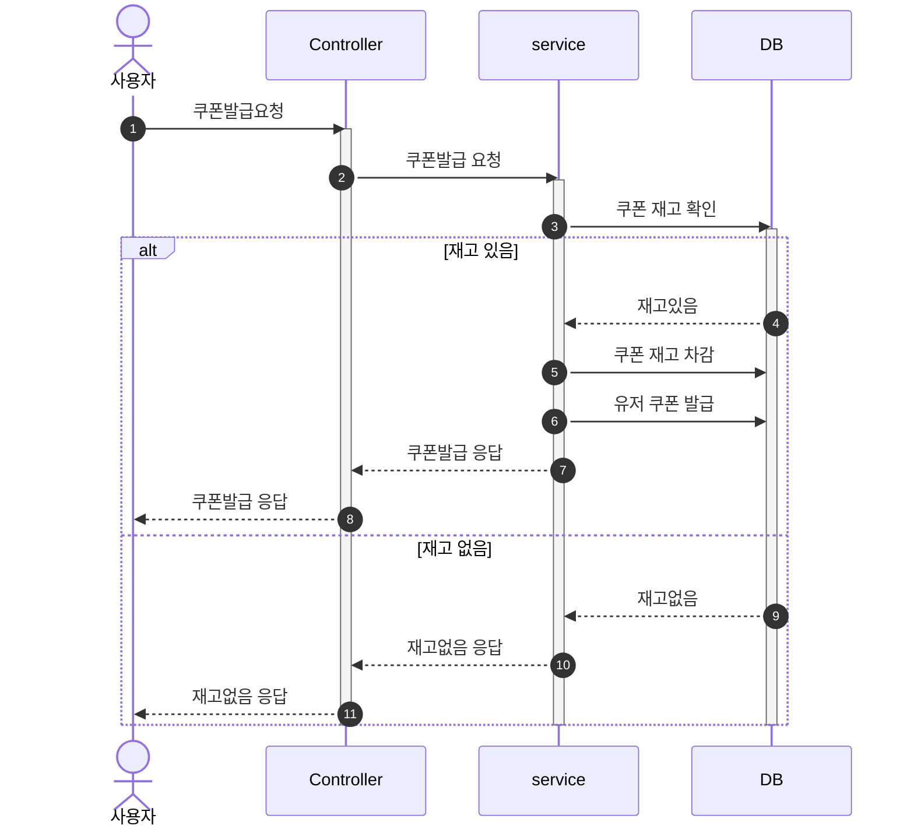
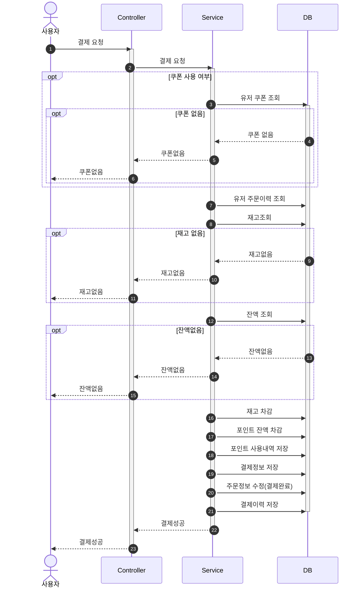
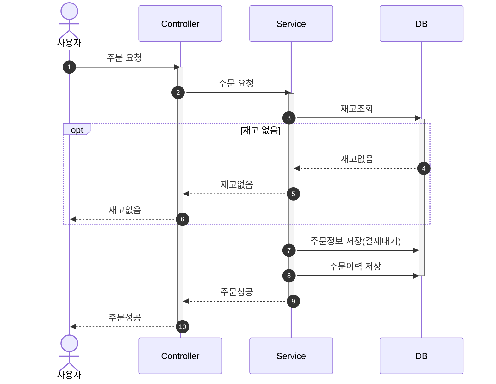

## 시퀀스 다이어그램
### 쿠폰 지급

```mermaid
sequenceDiagram
autonumber
actor 사용자
participant Controller
participant service
participant DB
## Getting Started
사용자->>Controller: 쿠폰발급요청
activate Controller
Controller->>service: 쿠폰발급 요청
activate service
service->>DB: 쿠폰 재고 확인
activate DB
alt 재고 있음
    DB-->>service: 재고있음
    service->>DB: 쿠폰 재고 차감
    service->>DB: 유저 쿠폰 발급
    service-->>Controller: 쿠폰발급 응답
    Controller-->>사용자: 쿠폰발급 응답
else 재고 없음
    DB-->>service: 재고없음
    service-->>Controller: 재고없음 응답
    Controller-->>사용자: 재고없음 응답
end
deactivate DB
deactivate service
deactivate Controller
```

### 결제

```mermaid
sequenceDiagram
autonumber
actor U as 사용자
participant A as Controller
participant S as Service
participant D as DB
#### Running Docker Containers
U->>A: 결제 요청
activate A
A->>S: 결제 요청
activate S
opt 쿠폰 사용 여부
    S->>D: 유저 쿠폰 조회
    activate D
    opt 쿠폰 없음
        D-->>S: 쿠폰 없음
        S-->>A: 쿠폰없음
        A-->>U: 쿠폰없음
    end
end
S->>D: 유저 주문이력 조회
S->>D: 재고조회
opt 재고 없음
    D-->>S: 재고없음
    S-->>A: 재고없음
    A-->>U: 재고없음
end
S->>D: 잔액 조회
opt 잔액없음
    D-->>S: 잔액없음
    S-->>A: 잔액없음
    A-->>U: 잔액없음
end
S->>D: 재고 차감
S->>D: 포인트 잔액 차감
S->>D: 포인트 사용내역 저장
S->>D: 결제정보 저장
S->>D: 주문정보 수정(결제완료)
S->>D: 결제이력 저장
deactivate D
S-->>A: 결제성공
deactivate S
A-->>U: 결제성공
deactivate A
```

### 주문

```mermaid
sequenceDiagram
autonumber
actor U as 사용자
participant A as Controller
participant S as Service
participant D as DB

U->>A: 주문 요청
activate A
A->>S: 주문 요청
activate S
S->>D: 재고조회
activate D
opt 재고 없음
    D-->>S: 재고없음
    S-->>A: 재고없음
    A-->>U: 재고없음
end
S->>D: 주문정보 저장(결제대기)
S->>D: 주문이력 저장
deactivate D
S-->>A: 주문성공
deactivate S
A-->>U: 주문성공
deactivate A
```
